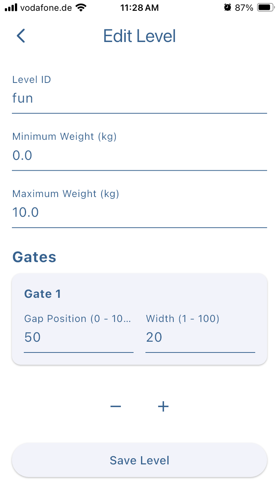

# The Edge - Hardware

This repository contains the hardware implementation of The Edge, a BLE-enabled weight sensor designed specifically for climbing training.

## Project Overview

## Project Structure

- [/board](board/README.md) - Hardware assembly instructions and component list
- [/microcontroller](microcontroller/README.md) - Firmware implementation and setup guide
- [/python_cli_app](python_cli_app/README.md) - Test utility (for development use)

## Mobile Application

The Edge hardware connects to "The Edge - Climbing Game" mobile application (available for iOS and Android), which transforms your climbing training into an interactive gaming experience. The app features real-time strength feedback, a progressive level system, and custom level creation capabilities, allowing you to turn training protocols into engaging challenges.

### App Demo

Check out the app in action:

### App Screenshots

   

## Getting Started

1. Follow the [hardware assembly guide](board/README.md) to build the device
2. Set up the [microcontroller firmware](microcontroller/README.md)
3. Install The Edge - Climbing Game from your device's app store
4. Connect the app to your Edge hardware via Bluetooth
5. Start training!

## Repository Contents

- `board/` - 3D models, assembly instructions, and parts list
- `microcontroller/` - CircuitPython firmware and configuration
- `pics/` - Project documentation images
- `python_cli_app/` - Test utility (for development use)
