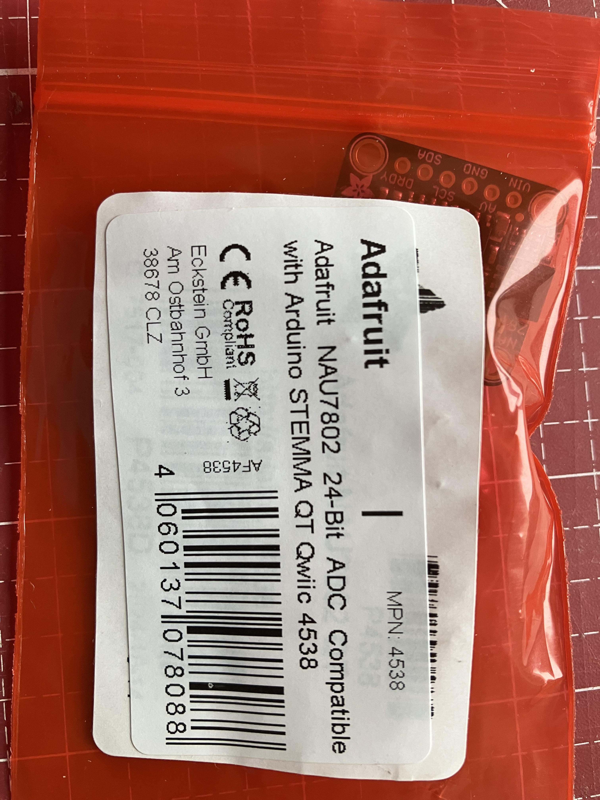
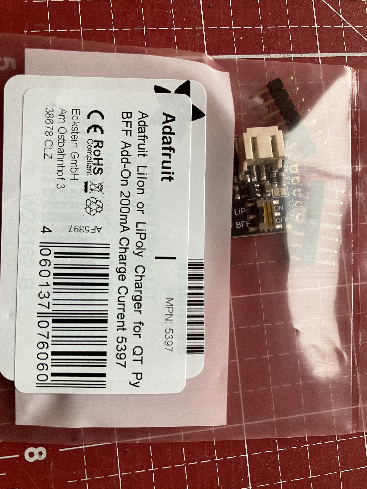
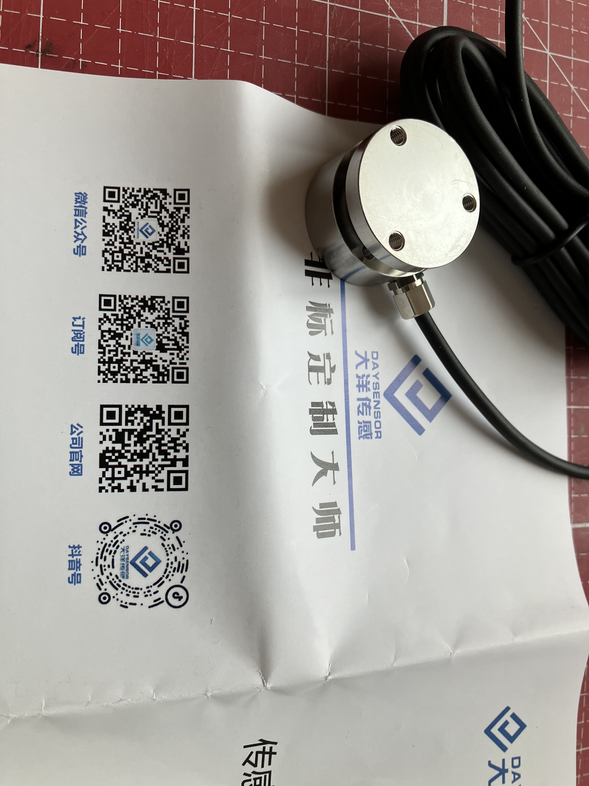
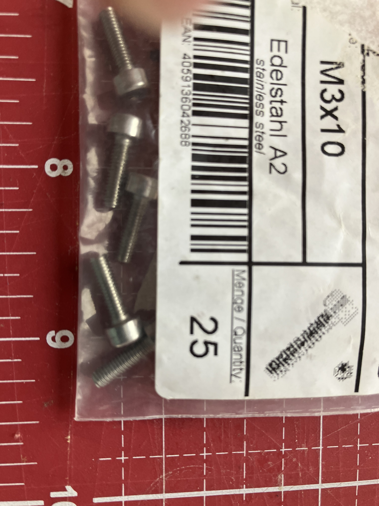
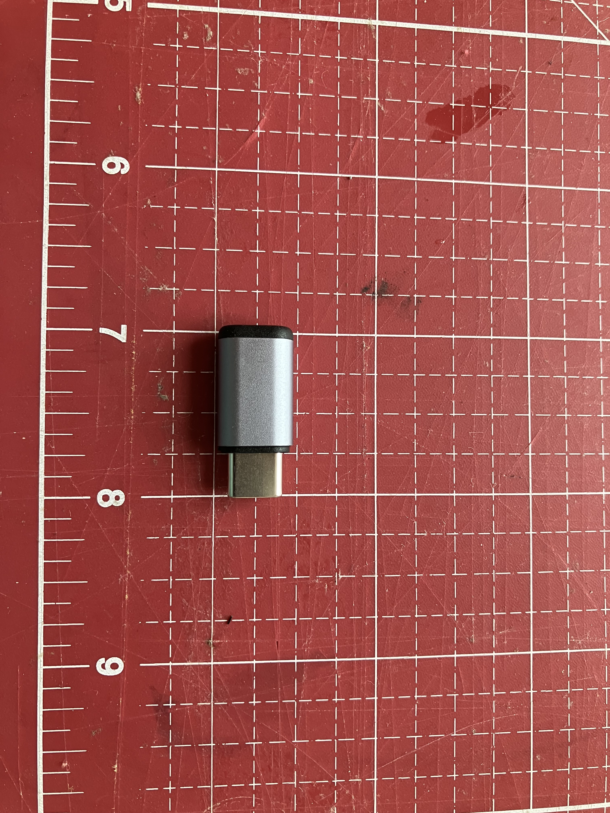
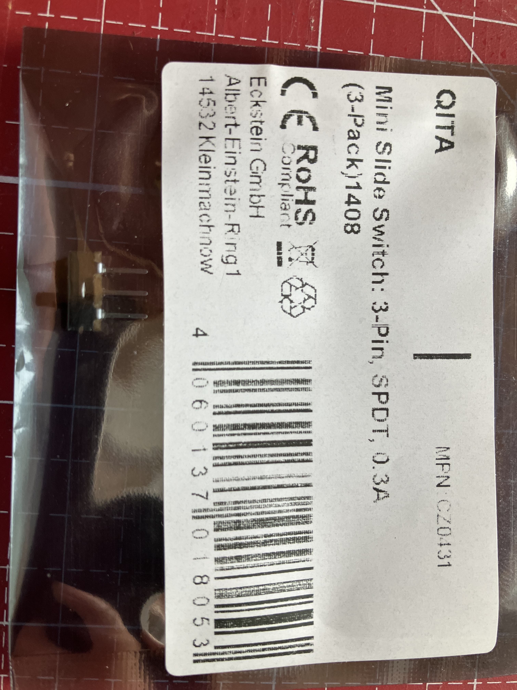
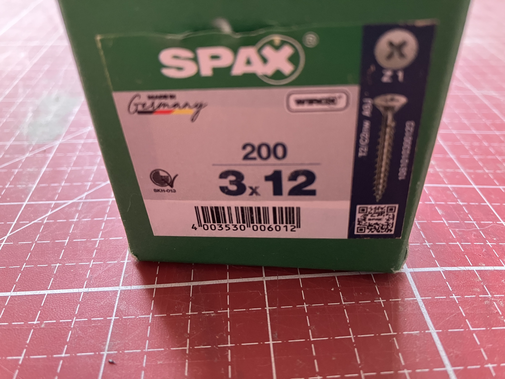
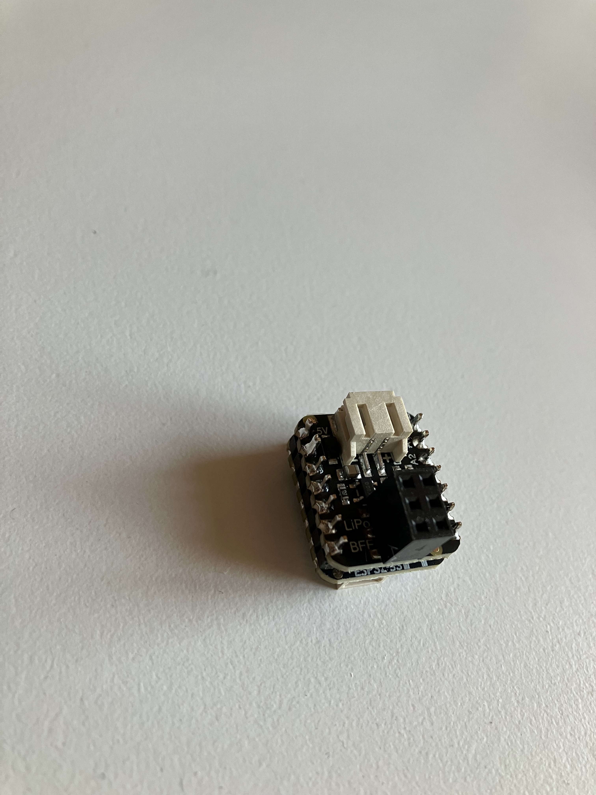
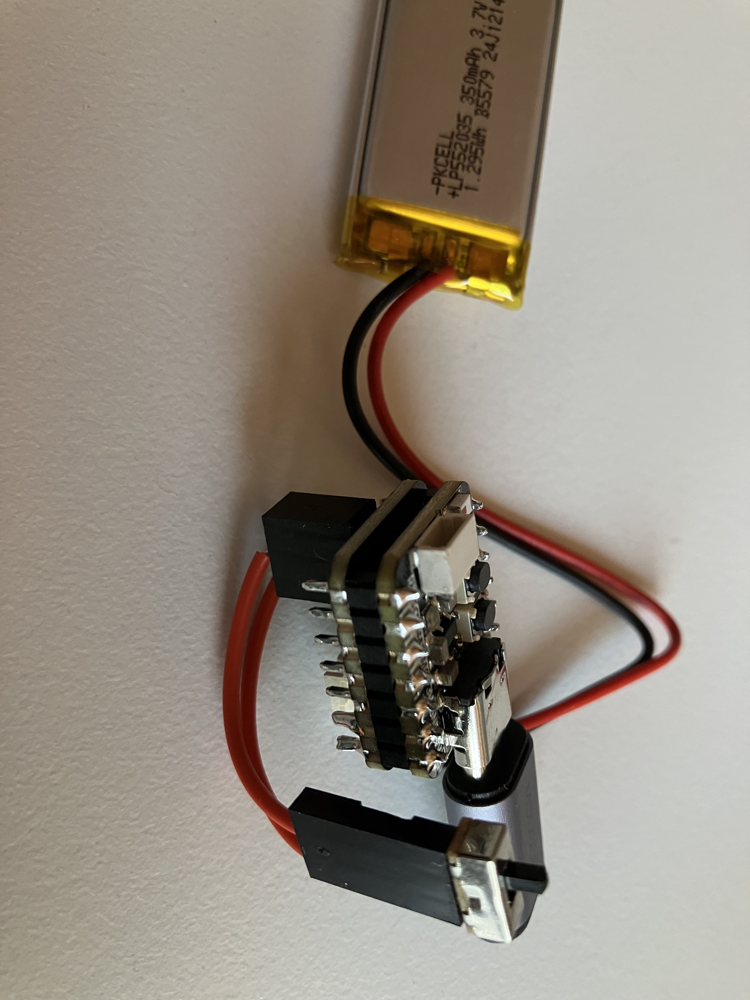
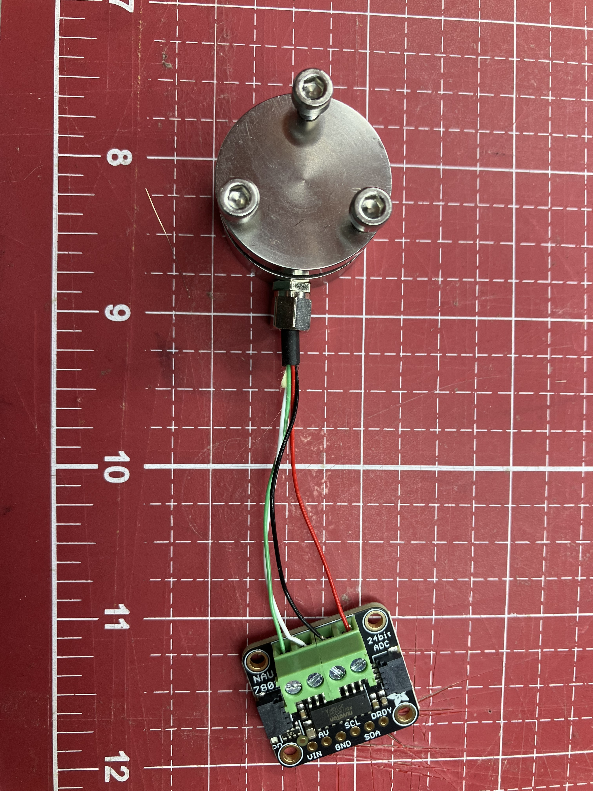

# Project Components

## Required Parts

- QT Py S3 8MB (No PSRAM)
  - [Purchase Link](https://www.adafruit.com/product/5426)
  - [Pinout Documentation](https://learn.adafruit.com/adafruit-qt-py-esp32-s3/pinouts)

  

- LiPo Backpack
  - [Purchase Link](https://www.adafruit.com/product/5397)
  - [Pinout Documentation](https://learn.adafruit.com/adafruit-qt-py-charger-bff/pinouts)

  

- 2x3 2.54mm SMD Female Connector

  

- NAU7802 ADC
  - [Purchase Link](https://www.adafruit.com/product/4538)
  - [Documentation](https://learn.adafruit.com/adafruit-nau7802-24-bit-adc-stemma-qt-qwiic/python-circuitpython)
  - [Example Code](https://github.com/adafruit/CircuitPython_NAU7802/blob/main/examples/nau7802_simpletest.py)

  

- LiPo Battery
  - Specifications: 3.7V 350mAh with JST-PHR-2 Connector (LP552035)

  

- Load Cell
  - Specifications: 25mm 0-200kg (Model: cn1501541594)
  - Manufacturer: XNQ Electric Company Store
  - [Purchase Link](https://www.aliexpress.com/item/33014551751.html)

  

- 3x M3 10mm Screws

  

- STEMMA QT/Qwiic JST SH 4-Pin Cable (≥50mm)

  

- USB-C Connector (7x12x26mm)
  - [Purchase Link](https://www.amazon.de/dp/B0BNNJ5RTG)

  

- Rope (6mm diameter, ca 1m length)

- Slide Switch with Cables
  - [Purchase Link](https://eckstein-shop.de/PololuMiniSlideSwitch3A3-Pin2CSPDT2C03A3-PackEN)

  

- 4x Screws (3x12mm)

  

- 3D Printed Parts in PETG:
  - Use 0.26 mm layer height, 4 perimeters, 50 percent infill
  - Set bridge angle to 90 degrees
  - Enable support for the edge

  

## Board Assembly Instructions

### Soldering Steps
1. Remove the existing switch from the LiPo backpack using hot air (350°C)
2. Solder the 3x2 female connector onto the board using hot air or reflow soldering

   

3. Solder the LiPo backpack to the QT Py S3
4. Prepare two 4cm cables with crimped ends and connect them between the 3x2 connector and the slide switch

   

### Sensor Cable Preparation
1. Cut the load cell sensor cable to 7cm length
2. Carefully remove the outer insulation and shielding
3. Strip approximately 2cm of insulation from each of the inner cables
4. Neatly twist and roll up the exposed cable ends to prevent fraying
5. Connect the prepared cables to the corresponding terminals on the NAU7802 ADC board

   

### Final Assembly
1. Insert the 3x M3 10mm screws into the load cell sensor mounting holes to secure the rope
2. Connect the NAU7802 to the QT Py using the STEMMA QT/Qwiic cable
3. Apply adhesive to mount the USB-C connector and slide switch in their designated positions
4. Ensure all components are securely mounted and connections are tight

   

### Info
- Battery Testing Results
  - Voltage: 2.9V under load, 3.6V from USB
  - Operating Time: 3.5 hours
  - Deep Sleep Mode: Battery did only last ~10 hours, so not used
- Adafruit QT Py ESP32-S3 Compatibility:
  - 4MB Flash 2MB PSRAM version not supported ("`no module named _bleio`")
  - Only 8MB No PSRAM version is supported
  - [Compatibility Matrix](https://docs.circuitpython.org/en/latest/shared-bindings/support_matrix.html)
